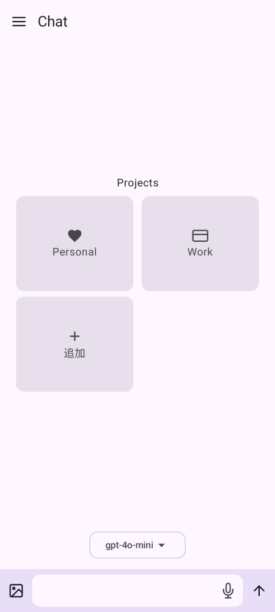

# ai-client

Kotlin Multiplatform で作られた AI クライアントです。Android と Desktop (JVM) に対応しています。

## ホーム画面


ホームではプロジェクトを選んでチャットを開始できます。下部の入力欄からそのままメッセージや画像を送れます。

## モジュール

- `app-android`: Android アプリ
- `app-desktop`: Desktop アプリ
- `ui`: 共有 Compose UI
- `room`: Room データベース

## ビルド

```sh
./gradlew assembleDebug
./gradlew :app-desktop:jvmJar
./gradlew ktlintCheck
```

## スクリーンショット更新

README の画像は Paparazzi が `@Preview` を自動収集して生成します。

```sh
./gradlew :app-android:recordPaparazziDebug
```
